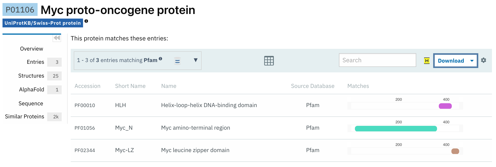

## Mutant Sequence and Healthy Sequence:

>wt_healthy
MDFFRVVENQQPPATMPLNVSFTNRNYDLDYDSVQPYFYCDEEENFYQQQQQSELQPPAPSEDIWKKFELLPTPPLSPSRRSGLCSPSYVAVTPFSLRGDNDGGGGSFSTADQLEMVTELLGGDMVNQSFICDPDDETFIKNIIIQDCMWSGFSAAAKLVSEKLASYQAARKDSGSPNPARGHSVCSTSSLYLQDLSAAASECIDPSVVFPYPLNDSSSPKSCASQDSSAFSPSSDSLLSSTESSPQGSPEPLVLHEETPPTTSSDSEEEQEDEEEIDVVSVEKRQAPGKRSESGSPSAGGHSKPPHSPLVLKRCHVSTHQHNYAAPPSTRKDYPAAKRVKLDSVRVLRQISNNRKCTSPRSSDTEENVKRRTHNVLERQRRNELKRSFFALRDQIPELENNEKAPKVVILKKATAYILSVQAEEQKLISEEDLLRKRREQLKHKLEQLRNSCA

>mutant_tumor
MDFFRVVENQQPPATMPLNVSFTNRNYDLDYDSVQPYFYCDEEENFYQQQQQSELQPPAPSEDIWKKFELLPTPPLSPSRRSGLCSPSYVAVTPFSLRGDNDGGGGSFSTADQLEMVTELLGGDMVNQSFICDPDDETFIKNIIIQDCMWSGFSAAAKLVSEKLASYQAARKDSGSPNPARGHSVCSTSSLYLVDLSAAASECIDPSVVEPYPLNDSSRPKSCASQDSSAFSPSSDSLLSSTESSPQGSPEPLVLHEETPYTTSSDSEEEQEDEEEIDVVSVEKRQAPGKRSESGSPSAGGHSKPPHSPLVLKRCHVSTHQHNYAAPPSTRKDYPAAKRVKLDSVRVLRQISNNRKCTSPRSSDTEENVKRRTHNVLERQRRNELKRSFFALRDQIPELENNEKAPKVVILKKATAYILSVQAEEQKLISEEDLLRKRREQLKHKLEQLRNSCA

## Q1. [1pt] What protein do these sequences correspond to? (Give both full gene/protein name and official symbol).

Gene Symbol: **MYC**

Gene Name: **MYC proto-oncogene, bHLH transcription factor**

Synonyms: **bHLHe39; c-Myc; MYCC**

Location: **chr8:127735434-127742951 (GRCh38)**

> This gene is a proto-oncogene and encodes a nuclear phosphoprotein that plays a role in cell cycle progression, apoptosis and cellular transformation. The encoded protein forms a heterodimer with the related transcription factor MAX. This complex binds to the E box DNA consensus sequence and regulates the transcription of specific target genes. Amplification of this gene is frequently observed in numerous human cancers. Translocations involving this gene are associated with Burkitt lymphoma and multiple myeloma in human patients. There is evidence to show that translation initiates both from an upstream, in-frame non-AUG (CUG) and a downstream AUG start site, resulting in the production of two isoforms with distinct N-termini. [provided by RefSeq, Aug 2017]

**Note**: The original sequences provided were previously aligned, should they have not been, we can use R to align ourselves. 


## Q2. [6pts] What are the tumor specific mutations in this particular case ( e.g. A130V)?

```{r}
# Load the bio3d package for sequence analysis
library(bio3d)

# Read the aligned FASTA file containing the healthy and mutant sequences
fasta <- read.fasta("A18573289_mutant_seq.fa")

# Calculate conservation across alignment positions
# Stored in a variable so R does not auto-print the vector
cons <- conserv(fasta)

# Logical vector identifying positions that are NOT conserved
# TRUE indicates a mutation at that alignment position
not_conserved <- cons != 1
```


```{r}
# Calculate the conservation score at each alignment position
# 'conserv()' examines the aligned FASTA sequences and assigns a score
# where 1 indicates full conservation across sequences
cons <- conserv(fasta)

# Create a table summarizing the non-conserved positions
data.frame(

  # Identify alignment positions where conservation is not equal to 1
  # 'which()' converts the logical test into numeric indices (positions)
  position = which(cons != 1),

  # Extract the conservation values at those same positions
  # Logical indexing keeps only entries where the condition is TRUE
  value = cons[cons != 1]

)
```

```{r}
# Identify the positions where the sequences are not conserved
# Uses the conservation vector calculated previously
diff_pos <- which(cons != 1)

# Create a table describing the mutation details
data.frame(

  # Alignment position where the sequences differ
  position = diff_pos,

  # Amino acid present in the healthy (original) sequence
  # fasta$ali[1, ] refers to the first sequence in the FASTA alignment
  wt_amino = fasta$ali[1, diff_pos],

  # Amino acid present in the tumor mutant sequence
  # fasta$ali[2, ] refers to the second sequence in the FASTA alignment
  mutant_amino = fasta$ali[2, diff_pos],

  # Combine WT amino acid + position + mutant amino acid
  # This produces the mutation notation used in biology (e.g., A130V)
  mutation = paste0(
    fasta$ali[1, diff_pos],
    diff_pos,
    fasta$ali[2, diff_pos]
  )

)
```

**Mutations**: 
Q194V, F210E, S219R, and P261Y


## Q3. [1pts] Do your mutations cluster to any particular domain and if so give the name and PFAM id of this domain? Alternately note whether your protein is single domain and provide it’s PFAM id/accession and name (e.g. PF00613 and PI3Ka).

### Consider:

To determine whether the mutations fall within a specific protein domain, the sequence can be analyzed using the HMMER search tool against the Pfam database. By submitting either the wild type or mutant protein sequence, the algorithm compares the sequence to profile Hidden Markov Models that represent known protein families and conserved domains. The output reports any detected Pfam domains along with their names, accession identifiers, and positional boundaries, which can then be compared with the mutation positions to determine whether they occur within a particular domain.

The positions of the identified mutations can be compared to the annotated Pfam domain boundaries shown in the UniProt domain architecture for MYC. By mapping the mutation positions onto these regions, it is possible to determine whether multiple mutations fall within the same functional domain. If several mutations occur within the same annotated region, this indicates that the mutations cluster within that specific Pfam domain.



> The positions of the identified mutations were compared with the Pfam domain annotations for the MYC protein obtained from UniProt. Mapping the mutation coordinates onto the domain architecture shows that these substitutions fall within the Myc_N amino-terminal region and ID:PF01056. This indicates that the mutations cluster within the MYC N-terminal regulatory domain rather than within the C-terminal helix-loop-helix or leucine zipper regions.

**Therefor, All identified mutations cluster within the Myc_N domain (Pfam: PF01056) of the MYC protein.**


## Q4. [2pts] Using the NCI-GDC list the observed top 2 missense mutations in this protein (amino acid substitutions)?

[Genomic Data Commons (GDC) Data Portal](https://portal.gdc.cancer.gov/)

.png)

**Top (2) Missense Mutations**: 
(10)S146L & (7)A44V


## Q5. [2pts] What two TCGA projects have the most cases affected by mutations of this gene? (Give the TCGA “code” and “Project Name” for example “TCGA-BRCA” and “Breast Invasive Carcinoma”).

**1)** TCGA-DLBC / Lymphoid Neoplasm Diffuse Large B-cell Lymphoma

**2)** TCGA-UCEC / Uterine Corpus Endometrial Carcinoma


## Q6. [3pts] List one RCSB PDB identifier with 100% identity to the wt_healthy sequence and detail the percent coverage of your query sequence for this known structure? Alternately, provide the most similar in sequence PDB structure along with it’s percent identity, coverage and E-value. Does this structure “cover” i.e. include or span the amino acid residue positions)of your previously identified tumor specific mutations?


PDB ID: 6G6J
Percent Identity: 100%
Query Coverage: residues 8–94 (~87 aa of ~454 aa ≈ ~19% coverage)
E-value: 4.764e-40

The structure only spans residues 8–94, while your mutations are at 194, 210, 219, and 261, which fall outside the resolved region.


## Optional 

> Q7. [10pts] Using AlphaFold notebook generate a structural model using the default parameters for your mutant sequence, colored by pLDDT confidence and mutation sites emphasized.)


**Mutations**: Q194V, F210E, S219R, and P261Y


```{r}
list.files()

```


```{r}
# Convert FLV video to MP4 using FFmpeg from within R

# Define input and output file names
input_file  <- "Johnathan copy.FLV"
output_file <- "Johnathan_copy.mp4"

# Run FFmpeg conversion
# -i : input file
# -c:v libx264 : encode video using H.264
# -c:a aac : encode audio using AAC
system(paste(
  "ffmpeg -i", shQuote(input_file),
  "-c:v libx264 -c:a aac",
  shQuote(output_file)
))
```

```{r}
system('ffmpeg -i "Johnathan copy.FLV" "Johnathan_copy.mp4"')

```


