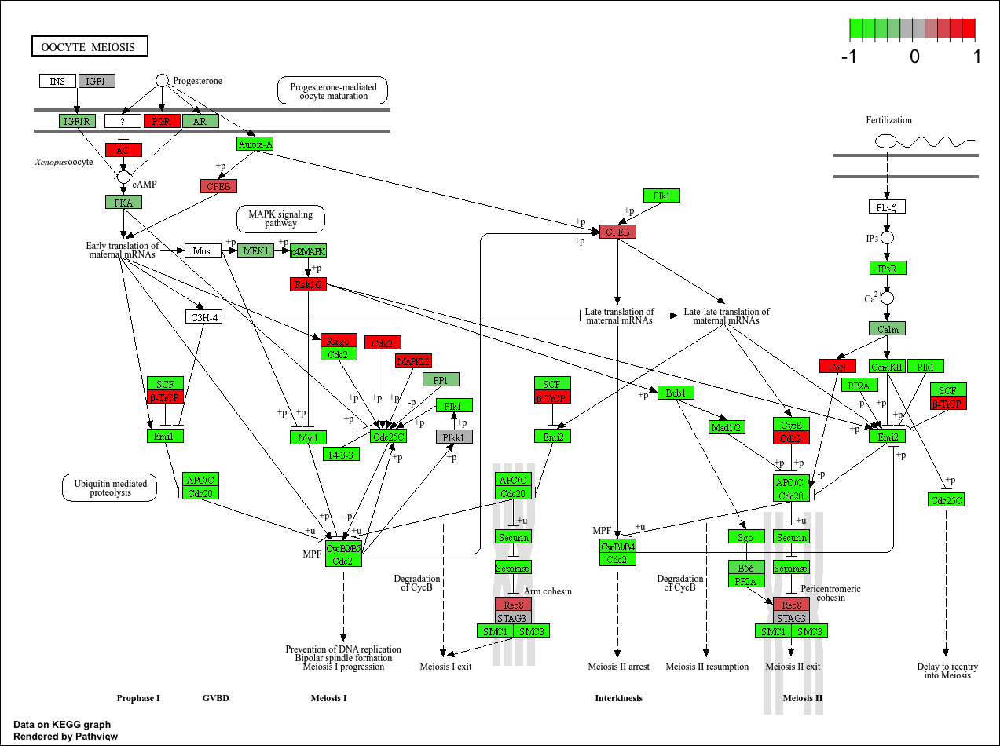

## Background

The data for this project comes from a K.O. experiment/study for HOX genes. 


## Data Import

```{r}
library(DESeq2)

countDataA <- read.csv("GSE37704_featurecounts.csv",row.names= 1)
  
colData <- read.csv("GSE37704_metadata.csv", row.names =1)   

```

```{r}
head(countDataA) 
head(colData)
```
## Clean up (data tidying)

>Q. Complete the code below to remove the troublesome first column from countData

```{r}
countDataB <- countDataA[,-1]
head(countDataB)
```

> Q. Complete the code below to filter countData to exclude genes (i.e. rows) where we have 0 read count across all samples (i.e. columns).


```{r}
countDataB <- countDataB[rowSums(countDataB) > 0, ]
head(countDataB)
```


## DESeq Analysis 

```{r}
# Build DESeq2 dataset object
dds <- DESeqDataSetFromMatrix(
  countData = countDataB, 
  colData   = colData,
  design    = ~ condition
)

# Run DESeq2 pipeline
dds <- DESeq(dds)

# Inspect object
dds
```

```{r}
res <- results(dds)
head(res)
```

>Q. Call the summary() function on your results to get a sense of how many genes are up or down-regulated at the default 0.1 p-value cutoff.

```{r}
summary(res)
```

## Volcano Plot 

```{r}
library(ggplot2)

ggplot(res) +
  aes(x = log2FoldChange,
      y = -log10(padj)) +
  geom_point()

```

>Q. Improve this plot by completing the below code, which adds color, axis labels and cutoff lines:


```{r}

# Create a color vector whose length equals the number of genes in res,
# initializing every entry to "gray".
mycols <- rep("gray", nrow(res))

# Update the color to "blue" for genes whose absolute log2 fold change exceeds 2.
mycols[ abs(res$log2FoldChange) > 2 ] <- "blue"

# Reset the color back to "gray" for genes with adjusted p-values greater than 0.01,
# ensuring only statistically significant genes remain highlighted.
mycols[ res$padj > 0.01 ] <- "gray"

# Generate a volcano plot where each point represents a gene from res.
ggplot(res) +
  # Map log2 fold change to the x-axis and the negative log10 adjusted p-value to the y-axis.
  aes(x = log2FoldChange,
      y = -log10(padj)) +
  # Plot each gene as a point using the precomputed color vector.
  geom_point(col = mycols) +
  # Label the x-axis to indicate effect size.
  xlab("Log2(FoldChange)") +
  # Label the y-axis to indicate statistical significance.
  ylab("-Log(P-value)") +
  # Draw vertical reference lines at the fold-change thresholds of -2 and +2.
  geom_vline(xintercept = c(-2, 2)) +
  # Draw a horizontal reference line at the adjusted p-value cutoff of 0.01.
  geom_hline(yintercept = -log10(0.01))
```


## Add annotation 
```{r}
library("AnnotationDbi")
library("org.Hs.eg.db")

columns(org.Hs.eg.db)

# Map Ensembl gene IDs in res row names to gene symbols.
res$symbol = mapIds(org.Hs.eg.db,
                    keys = rownames(res),
                    keytype = "ENSEMBL",
                    column = "SYMBOL",
                    multiVals = "first")

# Map Ensembl gene IDs in res row names to Entrez gene IDs.
res$entrez = mapIds(org.Hs.eg.db,
                    keys = rownames(res),
                    keytype = "ENSEMBL",
                    column = "ENTREZID",
                    multiVals = "first")

# Map Ensembl gene IDs in res row names to full gene names.
res$name = mapIds(org.Hs.eg.db,
                  keys = rownames(res),
                  keytype = "ENSEMBL",
                  column = "GENENAME",
                  multiVals = "first")

head(res, 10)
```
> Q. Finally for this section let's reorder these results by adjusted p-value and save them to a CSV file in your current project directory.

```{r}
res <- res[order(res$padj), ]

write.csv(res, file = "deseq_results.csv")

head(res)
```


## Pathway Analysis 

### KEGG

Run in your R console (i.e. not your Rmarkdown doc!)
BiocManager::install( c("pathview", "gage", "gageData") )

```{r}
library(pathview)
library(gage)
library(gageData)

data(kegg.sets.hs)
data(sigmet.idx.hs)

# Focus on signaling and metabolic pathways only
kegg.sets.hs = kegg.sets.hs[sigmet.idx.hs]

# Examine the first 3 pathways
head(kegg.sets.hs, 3)

```


```{r}
foldchanges = res$log2FoldChange
names(foldchanges) = res$entrez
head(foldchanges)
```
**gage pathway:**

```{r}
# Get the results
keggres = gage(foldchanges, gsets=kegg.sets.hs)
attributes(keggres)
```

```{r}
# Look at the first few down (less) pathways
head(keggres$less)
```
```{r}
pathview(gene.data=foldchanges, pathway.id="hsa04110")
```


### KEGG


```{r}
# A different PDF based output of the same data
pathview(gene.data=foldchanges, pathway.id="hsa04110", kegg.native=FALSE)


```
```{r}
## Focus on top 5 upregulated pathways here for demo purposes only
keggrespathways <- rownames(keggres$greater)[1:5]

# Extract the 8 character long IDs part of each string
keggresids = substr(keggrespathways, start=1, stop=8)
keggresids

```
```{r}
pathview(gene.data=foldchanges, pathway.id=keggresids, species="hsa")
```


> Q. Can you do the same procedure as above to plot the pathview figures for the top 5 down-regulated pathways?

```{r}
# Extract the top 5 downregulated KEGG pathways
keggrespathways_down <- rownames(keggres$less)[1:5]

# Extract the 8-character KEGG pathway IDs
keggresids_down <- substr(keggrespathways_down, start = 1, stop = 8)

# Display the pathway IDs
keggresids_down

# Generate pathview plots for the top 5 downregulated pathways
pathview(gene.data = foldchanges,
         pathway.id = keggresids_down,
         species = "hsa")
```



### GO


```{r}
data(go.sets.hs)
data(go.subs.hs)

# Focus on Biological Process subset of GO
gobpsets = go.sets.hs[go.subs.hs$BP]

gobpres = gage(foldchanges, gsets=gobpsets)

lapply(gobpres, head)
```

### Reactome
```{r}
sig_genes <- res[res$padj <= 0.05 & !is.na(res$padj), "symbol"]
print(paste("Total number of significant genes:", length(sig_genes)))
```
```{r}
write.table(sig_genes, file="significant_genes.txt", row.names=FALSE, col.names=FALSE, quote=FALSE)
```

>Q. What pathway has the most significant “Entities p-value”? Do the most significant pathways listed match your previous KEGG results? What factors could cause differences between the two methods?


Smallest Entities p-value: 2.1E-5
Cell Cycle, Mitotic

KEGG included cell cycle related pathways, for example hsa04110.

Therefore, yes, both identify the same type of pathways, cell cycle related ones.
Differences may arise due to gene annotations or enrichment algorithms. 